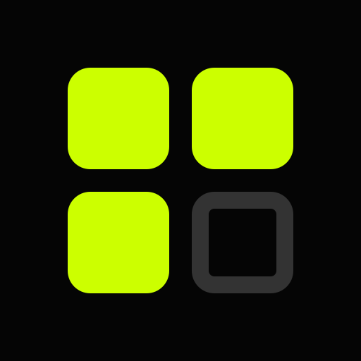

# Orbit

> A visceral visualization of time.



**Year Progress** is a minimalist Android application built to remind you of the passage of time. It combines high-contrast data visualization with ambient Android home screen widgets to keep you grounded in the present moment.

## Features

*   **365-Day Grid**: A complete visualization of the current year. Days lived are filled; the future is void.
*   **Ambient Data Widgets**: four "Ultra" widgets designed for your home screen.
    *   **The Entropy Grid (4x4)**: A raw 19x20 grid of your year.
    *   **The Solar Orbit (2x2)**: A celestial circular progress indicator.
    *   **The Precise Pulse (4x1)**: A text-based percentage display (e.g., `45.12%`).
    *   **The Ghost of 80 (2x2)**: A 'Memento Mori' grid of your assumed 80-year lifespan.
*   **Privacy First**: All data (birth date, gender) is stored locally on your device.
*   **Native Export**: Share a high-resolution snapshot of your year directly to Instagram/Twitter.
*   **Haptic Feedback**: Meaningful vibrations for every interaction.

## Tech Stack

*   **Frontend**: React, Vite, TypeScript
*   **Styling**: Tailwind CSS, Framer Motion
*   **Mobile Engine**: Capacitor 5
*   **Native Android**: Kotlin (Widgets, File System, Permissions)

## Getting Started

### Prerequisites
*   Node.js (v18+)
*   Android Studio (for building the APK)

### Installation

1.  **Clone the repository**
    ```bash
    git clone https://github.com/Yu-369/year-progress.git
    cd year-progress
    ```

2.  **Install Dependencies**
    ```bash
    npm install
    ```

3.  **Run Web Development Server**
    ```bash
    npm run dev
    ```

4.  **Sync with Android**
    ```bash
    npm run build
    npx cap sync
    ```

5.  **Open in Android Studio**
    ```bash
    npx cap open android
    ```
    Alternatively, build the APK directly:
    ```bash
    cd android
    ./gradlew assembleDebug
    ```

## Widgets

To add widgets:
1.  Long press your Android Home Screen.
2.  Select **Widgets**.
3.  Scroll to **Year Progress**.
4.  Drag and drop one of the 4 available widgets.

## License

MIT License.
